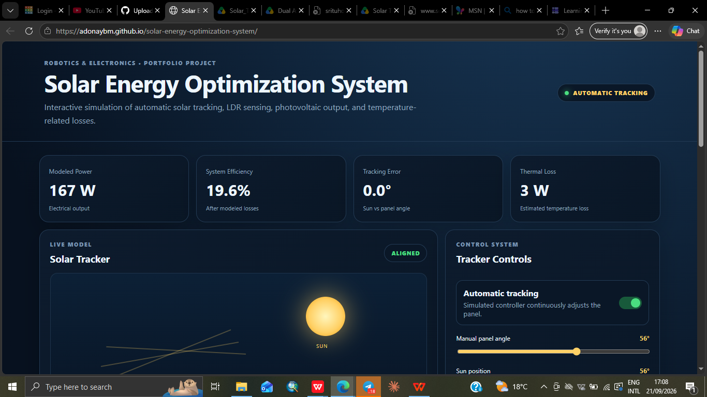

# Solar Energy Optimization System

An interactive engineering web application that models a photovoltaic system with automatic solar tracking, a simulated four-LDR sensor array, photovoltaic power calculations, and temperature-related efficiency losses.

## 🚀 Live Demo

[**Open the Solar Energy Optimization System →**](https://adonaybm.github.io/solar-energy-optimization-system/)

## 📸 Project Preview



## Project purpose

This project extends a physical solar-energy and solar-tracking interest into a computational model that can be tested, visualized, and explained.

The simulation demonstrates how:

- panel orientation affects incident solar energy;
- LDR sensor differences can be used as a tracking signal;
- an automatic controller can reduce angular tracking error;
- irradiance and panel area affect electrical output;
- photovoltaic efficiency changes with temperature;
- thermal/electrical losses reduce useful power.

## Main features

### Automatic solar tracking
The automatic mode continuously moves the simulated panel toward the selected sun position. A small controller step is used so the movement is gradual rather than an unrealistic instant jump.

### Four-LDR sensor simulation
The interface represents:

- Top Left LDR
- Top Right LDR
- Bottom Left LDR
- Bottom Right LDR

The sensor values change with the simulated angular error. Opposite sensor averages represent the information a tracker controller could use to decide movement direction.

### Power model

The simplified model is:

`P ≈ G × A × η × cos(θ) × T_factor`

Where:

- `P` = modeled electrical power
- `G` = solar irradiance in W/m²
- `A` = panel area in m²
- `η` = nominal PV efficiency
- `θ` = tracking error
- `T_factor` = simplified temperature correction

The prototype uses a 20% nominal efficiency for demonstration.

### Temperature model

The prototype uses an approximate coefficient of 0.4% per °C above a 25°C reference:

`T_factor = 1 - 0.004 × (T - 25)`

A lower bound is included to keep the educational simulation stable.

## Technology

- HTML5
- CSS3
- JavaScript
- Chart.js

## How to run

1. Download or clone the repository.
2. Open `index.html` in a modern browser.
3. An internet connection is recommended because Chart.js is loaded from a CDN.

No build system is required for this version.

## How to demonstrate it

### Automatic tracking demonstration

1. Enable **Automatic tracking**.
2. Move the **Sun position** slider.
3. Observe the panel gradually following the sun.
4. Watch the tracking error approach zero.
5. Observe the modeled power change.

### Manual tracking demonstration

1. Disable **Automatic tracking**.
2. Change the **Manual panel angle**.
3. Create a large difference between sun position and panel angle.
4. Observe the tracking error and reduction in modeled power.

### Thermal demonstration

1. Keep irradiance and angle constant.
2. Increase temperature.
3. Observe the temperature factor, cell temperature, efficiency, and thermal loss.

## Limitations

This is an educational simulation, not a calibrated photovoltaic engineering tool.

The LDR readings are simulated rather than measured.

The temperature model is simplified.

Real photovoltaic output depends on module specifications, irradiance spectrum, shading, temperature, wiring, controller losses, battery/load conditions, and other environmental factors.

For real engineering use, the equations should be calibrated against a specific panel's datasheet and field measurements.

## Future hardware integration

A natural next step is connecting an Arduino or ESP32 to the application.

Potential real inputs:

- Four LDR sensors
- Voltage sensor
- Current sensor
- Temperature sensor
- Motor/servo position

A hardware version could calculate:

`P = V × I`

and stream measurements to a dashboard.

## Portfolio description

**Solar Energy Optimization System** — Developed an interactive photovoltaic-system simulation that combines automatic solar tracking, a four-LDR sensing model, angular-error control, power estimation, and temperature-related efficiency analysis. The project extends a physical solar-energy/tracking concept into a computational environment for testing system behavior and control logic.

## Repository structure

```text
solar-energy-optimization-system/
├── index.html
├── style.css
├── script.js
└── README.md
```

## Academic integrity

This repository should describe simulation work as simulation and physical work as physical work. Real hardware measurements should only be added when they have actually been collected.
